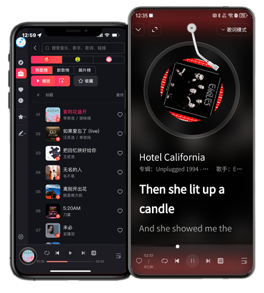
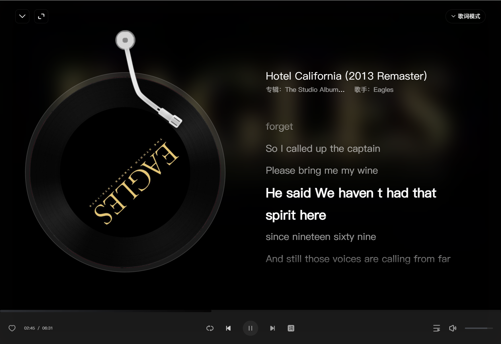

# Musiche - 跨平台音乐播放器

Musiche是一款跨平台音乐播放器，无论你使用的是Windows、macOS、Android、iOS、iPad还是Web，都能够享受到它带来的音乐世界。与网易云、QQ音乐、咪咕音乐等主流音乐平台无缝对接，让你的音乐体验更加畅快。

## 主要功能

### 发现音乐

探索各平台精心挑选的推荐歌单，让你发现更多喜爱的音乐。

### 我的音乐

登录你的账号，即可轻松管理各平台下的个人歌单，随时随地畅享你的音乐收藏。

### 音乐榜单

浏览各平台的热门榜单、新歌榜单以及飙升榜单，跟上音乐潮流。

### 我喜欢的音乐

收藏你喜欢的音乐，随时回顾，随心留存。

### 最近播放

记录你最近播放的歌曲，便于快速回听。

### 本地音乐

支持扫描本机音乐，并在应用内播放。

### 收藏歌单

收藏其他用户或平台的歌单，拓展你的音乐库。

### 创建歌单

自由创建属于你自己的歌单，分类整理你的音乐世界。

### 搜索音乐

支持歌名、歌手、歌词、分享链接搜索，快速找到你想听的歌曲。

### 音乐详情

展示歌曲的封面和歌词，提供四种不同风格的详情界面，满足不同用户的喜好。

### 桌面歌词

支持在所有平台及Web端显示桌面歌词，让你在聆听音乐的同时，轻松跟上歌词节奏。

### 设置界面

灵活的账号管理，支持二维码登录；可选的字体和主题，包括亮色、深色、暗色以及自定义背景等多种选择；个性化的快捷键设置和音质选择，让你尽情定制你的音乐体验。

### 下载

+ [PC版](https://hehang0.github.io/musiche/Musiche.exe)
+ [PC版(.NET6)](https://hehang0.github.io/musiche/Musiche.exe)
+ [MacOS版](https://hehang0.github.io/musiche/Musiche.dmg)
+ [Android版](https://hehang0.github.io/musiche/Musiche.apk)
+ [IOS版](https://hehang0.github.io/musiche/Musiche.ipa)
+ [在线版](https://hehang0.github.io/musiche/index.html)
